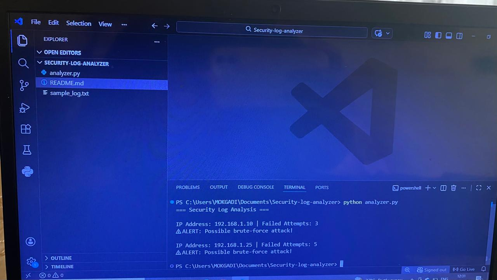

# Security Log Analyzer

Author: Mokgadi Magongwa

Description:
A Python script that analyzes login logs and detects suspicious login attempts.

Features:
- Detects failed login attempts
- Counts attempts by IP address
- Flags possible brute-force attacks

Technologies:
Python

## Program Output

